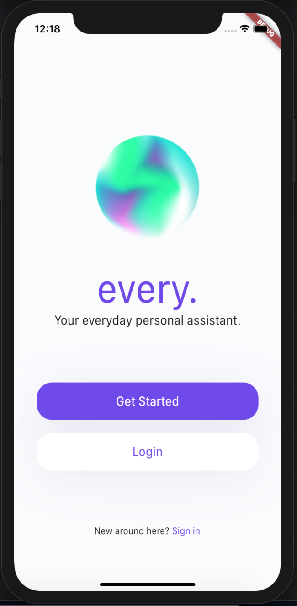
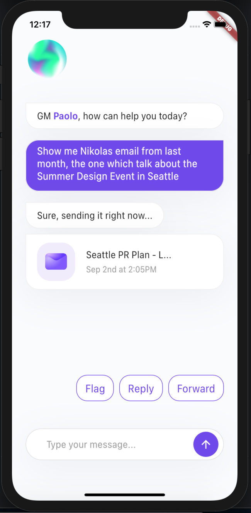
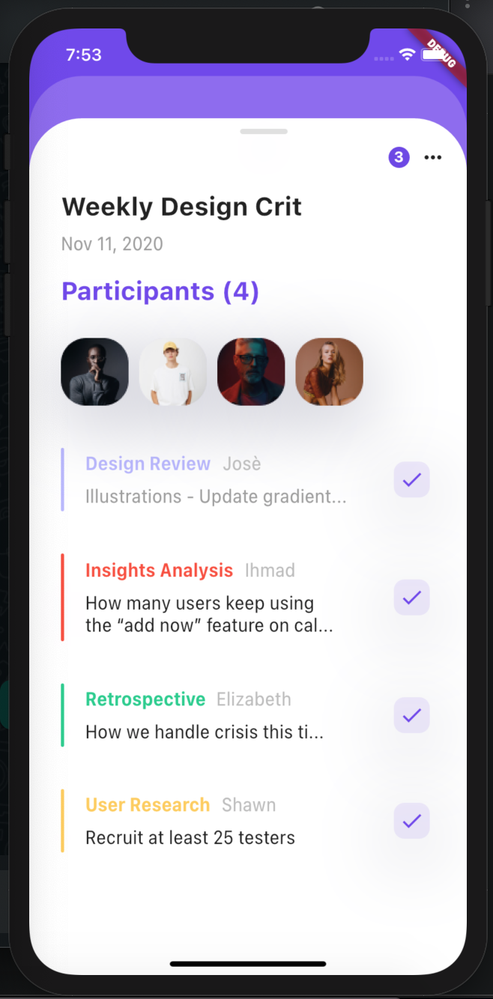
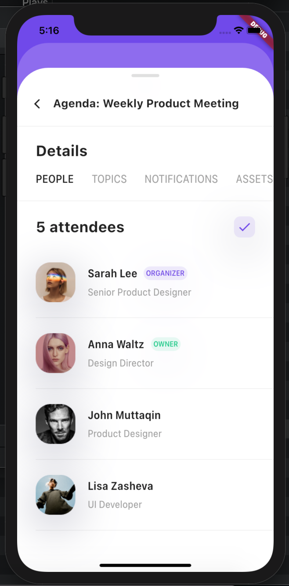

# UI-Kit
A Flutter UI Kit.

## ✨ Requirements
* Any Operating System (ie. MacOS X, Linux, Windows)
* Any IDE with Flutter SDK installed (ie. IntelliJ, Android Studio, VSCode etc)
* A little knowledge of Dart and Flutter
* A brain to think 🤓🤓

## 📸 ScreenShots

 
 

## Star ⭐ the repo if you like what you see

## 🤓 Author(s)
**Michael Olusegun**

